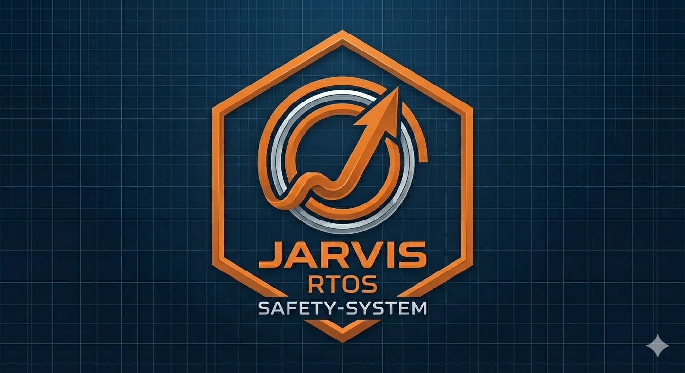

<p align="center">
  
</p>

<h1 align="center">Jarvis RTOS</h1>
<p align="center">
  <em>A deterministic, safety-critical real-time operating system built from scratch in freestanding C++20.</em>
</p>

<p align="center">
  
  
  
  
  
  
</p>

---

## Overview

Jarvis RTOS is an independent, ground-up implementation of a real-time operating system targeting **ISO 26262 ASIL D** safety standards. It is built exclusively in **freestanding C++20** — no libc, no libstdc++, no runtime — delivering zero-overhead object-oriented kernel design, compile-time type safety, and deterministic execution from the first instruction.

The kernel is currently monolithic, serving userspace processes at Ring 3 via a `int 0x82` syscall gate (47 syscalls). The architecture is mid-transition toward a **capability-based microkernel**, where drivers, VFS, and block I/O are externalised to sandboxed Ring 3 servers communicating through IPC capabilities.

Current version: **v0.3.1** — Deterministic Scheduling (O(1) priority bitmap scheduler, bounded WCET).

---

## Architectural Pillars

### Modern Freestanding C++20

The entire kernel — every scheduler data structure, every VFS vnode operation, every page-table walk — is written in freestanding C++20. There is no C legacy layer, no assembly veneer beyond the boot entry point and ISR stubs, and no reliance on hosted runtime primitives.

- **C++20 Concepts** used extensively for compile-time validation of synchronisation primitive interfaces, memory allocator traits, and architecture HAL requirements.
- **constexpr** and **consteval** enforce that all scheduling parameters, memory layout constants, and system limits are known at compile time.
- **RAII** is not a userspace luxury — it is the fundamental lifecycle model for every kernel resource: interrupt guards, page-table mappings, heap allocations, IPC mailbox handles, and file descriptors.
- **noexcept** by default. The kernel is compiled with `-fno-exceptions`, so every function contract is enforced statically or via assertion.
- No `malloc`, no `printf`, no `errno`. All memory comes from a deterministic slab allocator (`MemPool`), and all diagnostics go through a custom binary `Logger`.

### RAII-First Kernel Synchronisation

Every critical section in the kernel is enforced by a scoped guard, not by convention. The primary mechanism is `IrqGuard`:

```cpp
// kernel/arch/irq_guard.hpp
class [[nodiscard]] IrqGuard {
public:
    IrqGuard() noexcept { if (interrupts_enabled()) { cli(); irq_was_ = true; } }
    ~IrqGuard() noexcept { if (irq_was_) sti(); }

    IrqGuard(const IrqGuard&)            = delete;
    IrqGuard& operator=(const IrqGuard&) = delete;
    IrqGuard(IrqGuard&&)                 = delete;
    IrqGuard& operator=(IrqGuard&&)      = delete;

private:
    bool irq_was_;
};
```

This eliminates an entire class of check-then-act races because the guard cannot be forgotten, duplicated, or left dangling. The pattern extends to mutexes (with priority inheritance), semaphores, event groups, and the scheduler's internal dispatch — all protected by RAII wrappers that enforce unlock-on-destruction.

### Microkernel Paradigm Shift (In Progress)

Jarvis is intentionally transitioning from a monolithic service layer to a capability-based microkernel: a deliberate architectural migration planned over Phases 3–8 of the roadmap.

- **Phase 7 (v0.7.x):** VFS (`vfsd`) and block I/O (`iocd`) are externalised to Ring 3 servers. Filesystem drivers (FAT32, tmpfs) run as isolated userspace processes behind an IPC gateway. No kernel code holds a mount table reference.
- **Phase 8 (v0.8.x):** The kernel is reduced to scheduler + IPC + page-table manager + interrupt routing. The Shell, init (PID 1), VFS, and all device drivers run as Ring 3 capability-bearing servers. `SYS_CAP_GRANT` / `SYS_CAP_REVOKE` gate every cross-server access — no server can touch another server's MMIO region or memory without explicit capability delegation.

This migration is architected from the start: the current monolithic ring-0 service layer is structured as a set of isolated subsystems with clean interface boundaries, making the extraction to individual servers a matter of wrapping, not rewriting.

---

## Features

For a complete catalog of all implemented features — scheduler, IPC, VFS, hardware enablement, shell, test framework, dmesg diagnostics, and architectural comparison — see [`README_done.md`](README_done.md).

---

## IrqGuard in Practice

The following is extracted from the scheduler's `reschedule()` path — a critical section that must select the next task and prepare the context switch globals without interruption. The `IrqGuard` ensures `cli()` on entry and `sti()` (if interrupts were on) on any exit path, including early returns:

```cpp
void Scheduler::reschedule() noexcept {
    arch::IrqGuard guard;                     // RAII: cli() on construction
    if (task_count_ <= 1) return;             // safe early return — guard handles sti()

    auto* current = tasks_[current_index_];
    if (!current) return;

    auto* next = next_task();
    if (next && next != current) {
        if (next->state != TaskState::READY &&
            next->state != TaskState::RUNNING) return;

        switch_to_task(current, next);        // sets scheduler globals for ISR epilogue
    }
}                                             // guard destructor: sti()
```

Every synchronisation primitive in the kernel — `Mutex`, `Semaphore`, `EventGroup`, `Notify`, `MessageQueue` — follows the same RAII contract, making it structurally impossible to leak a critical section.

---

## Roadmap

Completed phases (v0.2.0–v0.2.23) archived in [`README_done.md`](README_done.md).

- [ ] **Phase 7 — Hard Real-Time** — O(1) bitmap scheduler, HPET, WCRT analysis, priority ceiling protocol, idle-task RAM March-C + ALU integrity monitors (ASIL D)
- [ ] **Phase 8 — SMP & Multicore** — APIC, per-CPU run queues, cache-colouring allocator, TLB shootdown
- [ ] **Phase 9 — System Integration** — 24h stress test, safety hardening, deterministic userspace libc
- [ ] **Phase 10 — Safety Systems** — Hardware/software watchdog, wait-for-graph deadlock detection, ASIL-D idle monitors
- [ ] **Phase 11 — Microkernel Transition** — Externalise VFS, drivers, block I/O to Ring 3 capability servers

Full roadmap at [`ROADMAP.md`](ROADMAP.md).

---

## Build & Quick Start

### Prerequisites

```bash
sudo apt install build-essential git wget xorriso dosfstools \
    x86_64-linux-gnu-gcc binutils qemu-system-x86
```

### Build & Run

```bash
git clone <repo-url>
cd os
make debug          # Debug build with 665-test suite
make qemu-iso       # Launch in QEMU with serial console
make release        # Optimised release build (no tests)

# Testing targets (QEMU)
make test-selftest       # Safe class (~102 tests, CI gate)
make test-all-debug      # Full 665-test suite (debug)
make test-all-release    # Release-candidate subset
make test-class CLASS=<name>  # Specific test class

# Renode simulation (multi-arch)
make run-renode RENODE_ARCH=x86_64   # x86_64 via SeaBIOS+ISO
make renode-test          # Renode CI validation
```

### Build Architecture

```
  [ Userspace Apps ] <─── Ring 3 Isolation
────── [ Syscall Interface: int 0x82 (47 syscalls) ] ──────
  [ Shell (Kernel Task, 36 built-ins) ]  [ RMS Scheduler        ]
  [ VFS / Initrd / Devfs / Procfs / FAT32 ] [ Priority IPC Mailbox]
  [ Virtual Memory (VMM, 4-level PT)    ]  [ Notify & Event Groups]
  [ O(1) PID→TCB Hash Table             ]  [ Priority Inheritance ]
  [ Physical Memory (PMM, Buddy Alloc)   ]  [ Slab Alloc (MemPool) ]
  [ Hardware: Serial, KBD, Framebuffer,   ]  [ ATA PIO, PIT, RTC    ]
  [ PCI, Virtio, ACPI                    ]  [ RNG, FPU Lazy Switch ]
  [ Gcov, Driver Registry, Integrity     ]  [ Deadlock Detection   ]
═════════════ Monolithic Kernel (Ring 0) ═════════════
```

---

## Call for Contributions

Jarvis RTOS is an architectural project first and a feature project second. We are seeking contributions from engineers who value **structural correctness over velocity**:

- **Lock-free data structures** for ISR→task handoff (SPSC ring buffers, hazard pointers)
- **C++20 memory model experts** for formalising the kernel's atomic ordering guarantees (the scheduler uses `volatile` globals today — a migration path to `std::atomic` with `memory_order` is a high-priority engineering goal)
- **Bare-metal systems engineers** for ARM Cortex-A (aarch64) and RISC-V (RV64) port bring-up (arch HAL abstraction, linker scripts, MMU init, GIC/PLIC interrupt controllers)
- **Formal methods** — model-checking the wait-for-graph deadlock detector, proving the rate-monotonic schedule is feasible under declared WCETs

### Principles

- **Architecture over features.** A new driver does not ship without a test, a `ResourceTracker` entry, and a documented failure mode.
- **Compile-time over run-time.** If a constraint can be expressed in C++20 Concepts or `constexpr`, it should be.
- **Determinism is non-negotiable.** No dynamic allocation in the scheduler path, no unbounded loops in ISRs, no spinlocks that disable preemption for more than a single cache-line read.

If this aligns with your engineering philosophy, open an issue or pull request. Code review is rigorous and architectural — expect line-by-line attention to every `IrqGuard` placement.

---

## License

Jarvis RTOS is free software: you can redistribute it and/or modify it under the terms of the **GNU General Public License**, either version 3 of the License, or (at your option) any later version. See [`LICENSE.txt`](LICENSE.txt) for the full text.
